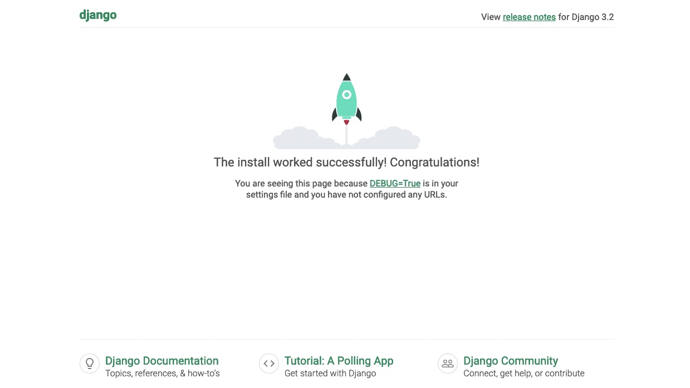
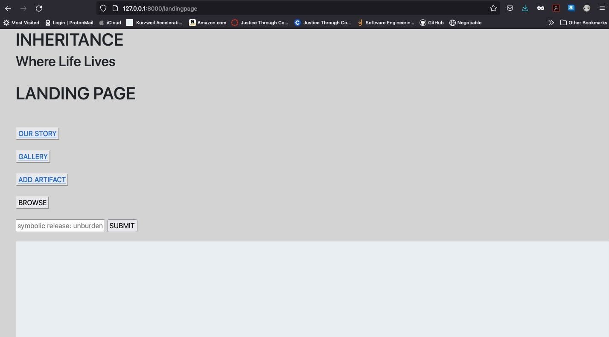
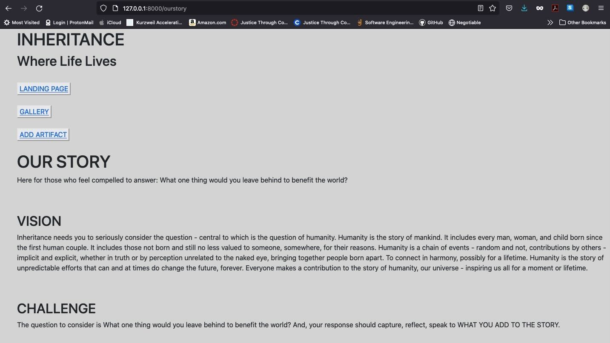
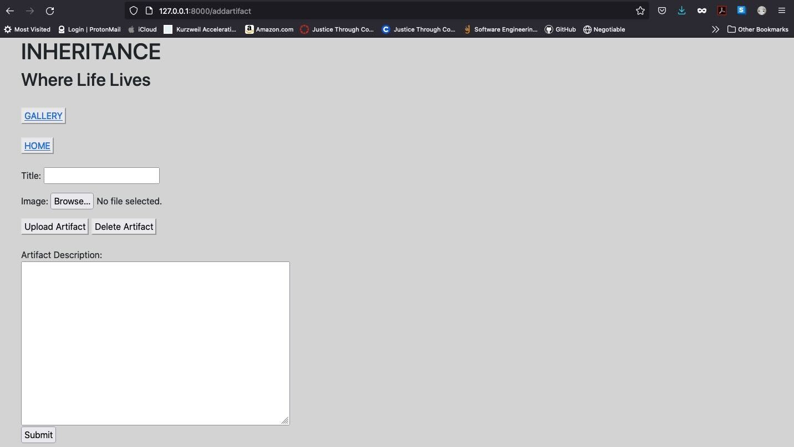
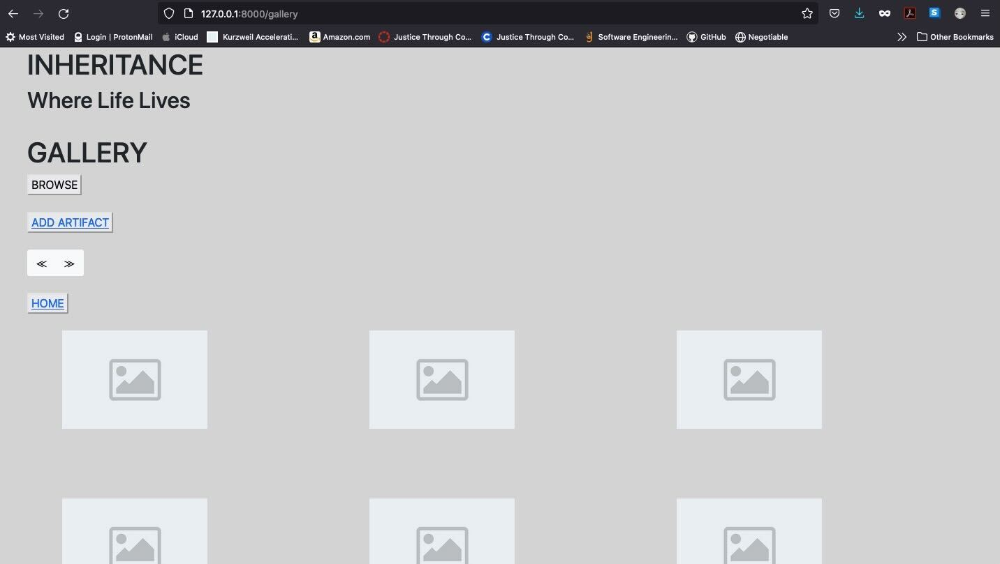

# **INHERITANCE DOT ARTIFACTS**

#### destined for existence as an app and/or online at `https://inheritance.artifacts` accompanied by tagline _'where life lives'_

#### [visit inheritance artifacts live demo](https://inheritance-artifacts.herokuapp.com/)

 

### **PRIMARY WOW PROJECT COLLABORATORS** 

Jason Doze 
[GITHUB UN: Jason-Doze](https://github.com/Jason-Doze) 

La'Tonia Mertica Sheppard Walker 
[GITHUB UN: LaTonia-Mertica](https://github.com/LaTonia-Mertica) 

### **MENTOR SUPPORT** 

- Chris Baker, Justice Through Code
- Nate Evans, Careers in Code
- Chelsea Troy, Emergent Works
- Max Matthews, Careers in Code

###### [view flow chart](images/Flowchart.png)

###### [view landing page wireframe](images/landingpagewireframe.png)

###### [view gallery wireframe](images/gallerywireframe.png)

###### [view add artifact wireframe](images/addartifactwireframe.png)

###### [view entity relationship diagram](images/ERD.png)

 

### **HELPFUL SETUP INSTRUCTIONS & INSIGHT**

#### 
_for your own code safety, please be prudent about researching to meet your specific code needs_

---

 

**USE VENV TO CREATE & RUN VIRTUAL ENVIRONMENTS:** 

1. Execute VENV Command to Create 
   1a. Mac aka BASH/ZSH Users run _`python3 -m venv /path/to/new/virtual/environment`_ 
   1b. PC aka Windows Users run _`c:\>c:\Python35\python -m venv c:\path\to\myenv`_ 
   **note:** basically you want to run `python3 -m venv django-env` while replacing _django-env_ appropriately

2. Execute Activate Command 
   2a. MAC aka BASH/ZSH Users run _`source django-env/bin/activate`_ 
   2b. PC aka Windows Users run _`django-env\Scripts\activate.bat`_ and if it doesn't work run _`django-env\Scripts\activate.ps1`_

3. Execute Run Server Command 
   3a. Mac aka BASH/ZSH **and** PC aka Windows Users run _`python`_ _`manage.py`_ _`runserver`_ from app level - which is the same level within the project that contains the `manage.py` file/utility to start Django server (more info below in the run django application instructions)

###### [learn more re: creating and activating virtual environments](https://docs.python.org/3/library/venv.html)

 

**USE PIP TO INSTALL PROJECT DEPENDENCIES:** 

1. if installing after cloning a repo, run _`pip install -r requirements.txt`_ to execute the command to read the requirements file and install everything in it

2. if pip is already installed and want to install a package, run _`pip install [insertpackagenamehere]`_ 
   2a. next run _`pip freeze > requirements.txt`_ 
   2b. this command creates a file called _requirements.txt_ while populating the file with dependencies resulting from the install command in step 1 above. from the command line aka terminal run _`cat requirements.txt`_ to view dependencies listed in the file

**note:** pip is the standard package manager for python. [visit python package index to learn more about packages](https://pypi.org/). the command _`pip install`_ must be followed by the package you want to install. the command can be run to install the package with or without its dependencies

###### [learn more re: pip install](https://pip.pypa.io/en/stable/cli/pip_install/)

###### [learn more re: using pip to install project dependencies](https://stackoverflow.com/questions/53925660/installing-python-dependencies-locally-in-project)

 

**RUN A DJANGO APPLICATION:** 

1. You must use the `manage.py` file/utility to run the server. From the command line/terminal `cd` to the level where the `manage.py` file/utility lives. Run the command _`python`_ _`manage.py`_ _`runserver`_. You will know the command was successful when you see the following message (or something similar):

"Watching for file changes with StatReloader
Performing system checks...

System check identified no issues (0 silenced).
You have 17 unapplied migration(s). Your project may not work properly until you apply the migrations for app(s): admin, auth, contenttypes, sessions.
Run 'python `manage.py` migrate' to apply them.
May 17, 2019 - 16:09:28
Django version 2.2.1, using settings 'mysite.settings'
Starting development server at `http://127.0.0.1:8000/`
Quit the server with CONTROL-C.
"

 

 

**note:** the above message means the django application is running, you must visit the `http://127.0.0.1:8000/` link to access the django application in browser. [the django welcome/homepage](images/django-welcome-homepage.png) may look like an error or exception. this is until you read what it says and follow the instructions to add url endpoints per your project into the browser. for example, `http://127.0.0.1:8000`/(insert your url endpoint here without including the parentheses).
 
 

###### [visit us at trello for insight on general planning and organization](https://trello.com/b/LhG4cich/inheritanceartifacts)

 

### **HOW INHERITANCE DOT ARTIFACTS WORKS**

#### 
_visit the pages, maybe even add your own artifact to the inheritance community - just please embrace the concept_

---

 

Landing Page establishes overall ambiance and navigation. It also, through SYMBOLIC RELEASE, demonstrates our elevated dedication to self-awareness, getting beyond barriers, and holistic health.
 
 

Our Story shares insight, intent, and sense of community at the heart of the creation of Inheritance.
 
 

Add Artifact is the opportunity to consider what you will add to the story. In other words, what image and description you would submit as an artifact.
 
 

Gallery is a collection of the vibrancy of contributions through shared artifacts.
 
 
**NEXT STEPS**

- fluid interlocking image design on gallery page per image sizes
- maintain db content on re/new deploy (not delete on new deploy)
- revisit backlog and prioritize series of subsequent implementations
- purchase and implement domain for polished custom url experience
- upgrade [heroku.com](https://www.heroku.com/) account to basic paid to maintain active server
